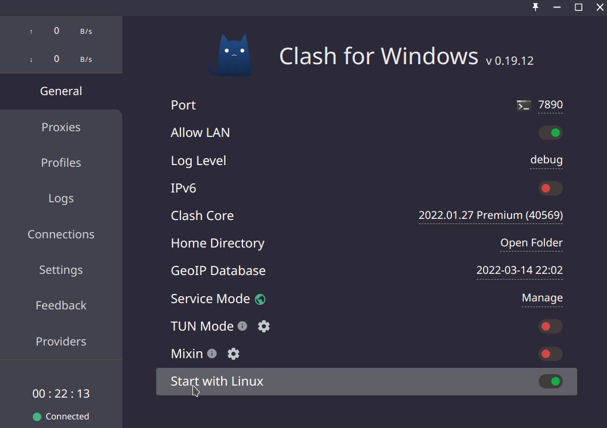
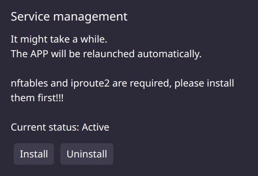
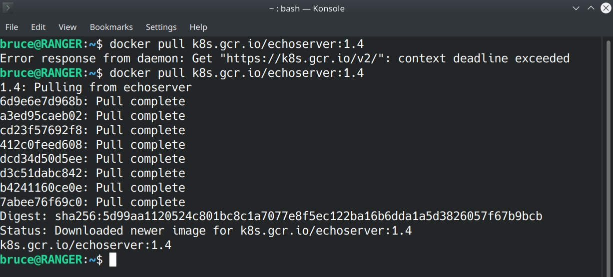
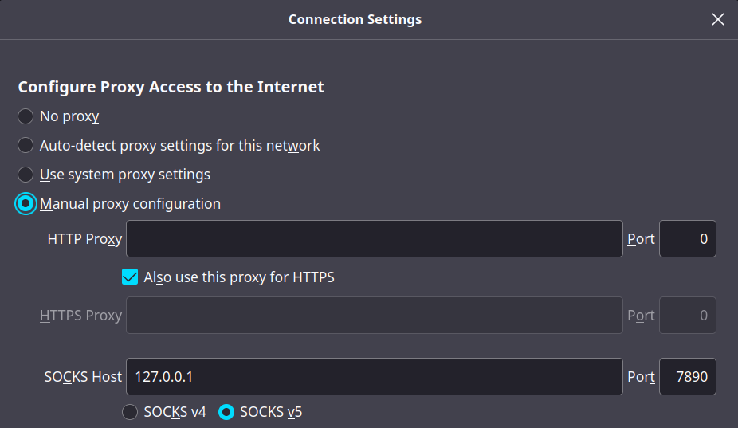
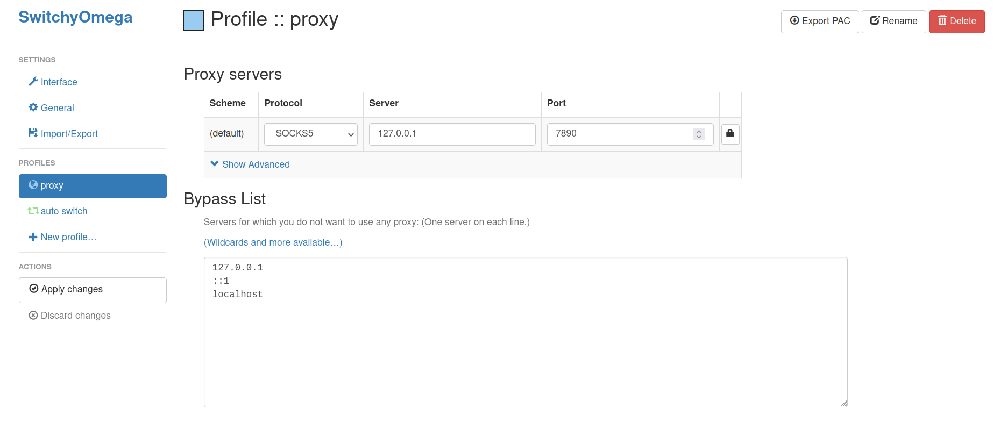

## 缘起

过一段时间后会去鹅厂实习，听在里面的好哥哥说现在公司变抠门了，实习生不给发mac了，然后一直以来都在 windows 上踩了不少坑，遂决定用linux开发适应一段时间，如果还可以的话到时候实习就自己装一个用咯

其实一直都想试试，但之前都没啥时间，现在刚好有个实习前的空档期，那就折腾一下吧。发行版选择了 kubuntu（主要是考虑到ubuntu较为方便、稳定，而个人又比较喜欢kde）装好系统后，第一件事情就是配好梯子，所以就有了这篇水文😳


## 代理 or 镜像源

当我们开发过程中使用各种服务时，经常会因为 [GFW](https://zh.wikipedia.org/wiki/%E9%98%B2%E7%81%AB%E9%95%BF%E5%9F%8E) 的原因，遇到种种网络问题，使用镜像源一般能解决基本的下载问题（也有很多例外情况），但是没有普适性而且不优雅，假如你要下载的包/服务刚好镜像源没有呢？而且镜像也仅仅只能满足你下载的需求 

而为你的开发环境配置好代理服务能从根本上解决问题


## 环境说明

测试环境：[kubuntu20.04LTS](https://kubuntu.org/) 、[Clash for Windows](https://github.com/Fndroid/clash_for_windows_pkg) 

配置需求：任意linux发行版、机场 or 代理

推荐应用：[Clash for Windows](https://github.com/Fndroid/clash_for_windows_pkg) 、[proxychains-ng](https://github.com/rofl0r/proxychains-ng) 、[privoxy](http://www.privoxy.org/)


## 认识你的代理

>   推荐这篇文章了解不同的翻墙协议：[科学上网的主流协议大对比](https://www.techfens.com/posts/kexueshangwang.html)
>
>   电丸科技AK的频道：[「硬核翻墙/科学上网」系列](https://www.youtube.com/watch?v=XKZM_AjCUr0&list=PLqybz7NWybwUgR-S6m78tfd-lV4sBvGFG)
>
>   机场的测速与选择：[DuyaoSS-机场测速和简介](https://duyaoss.com/)

不同的机场、不同的价格、不同的产品会提供不同的翻墙协议的代理服务，目前主流的翻墙协议有ss、ssr、VMess、trojan等所以首先你需要弄明白你的供应商给你的是什么类型的节点（通常都会提供ss），然后提供的类型选择对应的代理客户端

除此之外，你还需要获取机场提供的托管 or 订阅连接方便节点导入


## 代理客户端

>可以看看这篇文章的整理：[SS/SSR/V2Ray/Trojan/Clash 简介和客户端软件下载](https://congcong0806.github.io/2018/04/20/SS/)

linux上可以选择的代理客户端也挺多，比较流行的有 shadowsocks 客户端（最流行的代理协议，大多数机场都支持），v2ray衍生，Clash 系列，他们都有对应不同平台的GUI/CLI版本，这里简单搜集一下方便大家选择：

-   [shadowsocks 社区](https://shadowsocks.org/en/index.html)官方客户端（仅支持ss）：https://shadowsocks.org/en/download/clients.html
-   [v2ray 官网](https://www.v2ray.com/)列举的客户端（必然支持VMess，其他协议支持情况不同）：https://www.v2ray.com/awesome/tools.html
    -   注：Qv2ray [原项目](http://qv2ray.net/)已经停止维护，但有原作者另开项目更新维护，[详情见此](https://github.com/Shadowsocks-NET/Qv2ray)（甚至还出了3.0版本！）
-   [Clash](https://github.com/Dreamacro/clash)：本身就是一个支持VMess, Shadowsocks, Trojan, Snell协议的多平台代理客户端（CLI，一般配合web gui用），图形客户端的话推荐下面3个，别的不推荐
    -   [Clash for Windows](https://github.com/Fndroid/clash_for_windows_pkg) 一个支持 Windows/macOS/Linux 的很流行的图形客户端（后文简称CFW），**推荐使用**😁
    -   [ClashX](https://github.com/yichengchen/clashX)：Clash 的 Mac 图形客户端
    -   [ClashForAndroid](https://github.com/Kr328/ClashForAndroid)：Clash 的 Android 图形客户端，

上面除了 Qv2ray 新维护版本以及 ClashX 我没用过，其他的客户端都有使用或者正在使用，考虑到博客篇幅以及简单易用的原则，我在这里选择使用CFW的linux版本，他基本上和win版差不多，比较方便使用，客户端选择适合自己的即可，如果你是冲浪小白，建议选择博主推荐的CFW

配置客户端的时候需要注意提供代理服务的相应端口，比如Clash新版使用`Mixed Port`可以提供端口都是`7890 (default)`的http和socks5 proxy服务；而如果你使用shadowsocks作为你的客户端，他只能提供端口为`8080 (default)`的socks5 proxy，然而并不是所有应用都支持socks5的，大部分只支持http/https proxy，所以你可能需要额外使用一些工具（比如 [privoxy](https://www.privoxy.org/) ）监听socks5端口并将它转换为http proxy


### CFW 安装及配置

#### 安装

在这里提供CFW的配置方法，其他客户端的配置待未来更新（不保证）

>   仅供参考，请勿无脑照搬命令

在CFW的 [releases 页面](https://github.com/Fndroid/clash_for_windows_pkg/releases)下找到对应的版本复制下载链接，并打开终端使用wget下载并解压到`/usr/local`（你也可以用自己的方式下载并解压到你心仪的目录）：

```bash
# 切换到下载目录
$ cd ~/Downloads/
# 可以自行最新版本（因为github没有被墙，所以只是网速慢，可以多试几次）
$ wget https://github.com/Fndroid/clash_for_windows_pkg/releases/download/0.19.12/Clash.for.Windows-0.19.12-x64-linux.tar.gz
# 解压到当前文件夹
$ tar -xvf Clash.for.Windows-0.19.12-x64-linux.tar.gz
# 移动到/usr/local/并重命名为CFW[可选]
$ sudo mv Clash\ for\ Windows-0.19.12-x64-linux/ /usr/local/CFW
# 后台静默运行CFW
$ /usr/local/Clash\ for\ Windows/cfw &
```

启动后将会有CFW的GUI弹出，在左侧`General`栏中可以看到（你的栏目可能与我的有所不同，这是因为我的托管配置提供了额外的`Providers`选项），clash默认使用的端口是`7890`，我们要记住这个端口号，后面会经常使用

>老版本的 CFW 的 `http`端口 和 `socks5` 端口是不同的， 新版本后使用`Mixed Port` 就统一成`7890`




#### 导入代理配置

clash使用`yaml`文件配置节点信息，CFW会自动读取`~/.config/clash/profiles/`下存放`.yaml/yml`配置文件，通常情况下，我们只需要复制机场供应商提供的clash托管连接粘贴至`Profiles`并点击下载即可使用

如果很不幸，你只有可以使用的少量节点需要自行配置，那你可以编辑配置文件，细节请查看[此文档](https://docs.cfw.lbyczf.com/contents/configfile.html#profiles-xxxx-yaml)


#### 配置 Service Mode [可选]

在linux版本中，默认的代理模式只有全局，也无法使用一些高级功能（比如TUN Mode），我们需要安装额外的插件

[官方文档](https://docs.cfw.lbyczf.com/contents/questions.html#service-mode-%E6%97%A0%E6%B3%95%E5%AE%89%E8%A3%85)提供以下快捷方式：

```bash
$ curl https://gist.githubusercontent.com/Fndroid/2119fcb5ccb5a543a8f6a609418ae43f/raw/592eba4f480c7ccb4f29c9b8e80d24bfd5dda8cf/linux.sh > cfw-tun.sh && chmod +x cfw-tun.sh && sudo cfw-tun.sh install <cfw安装目录>
```

在本例中，`<cfw安装目录>`为`/usr/local/CFW/`

我们也可以点击`Manage`自动安装，前提是系统需要先装有`nftables`和`iproute2`，可以直接使用包管理工具自动安装：

```bash
# ubuntu/kubuntu可以使用apt
$ sudo apt install nftables
$ sudo apt install iproute2
```

安装完成后再点击`Install`



如果安装成功，重启后`General`栏显示的`Service Mode`项的地球图标将变为绿色，可以发现右下角的小猫咪已经支持各种代理模式了，这里的话推荐大家使用Rule模式，如果遇到一些外国网站无法


#### 使用 TUN/TAP Mode [推荐]

需要先安装好Service Mode，对于不遵循系统代理的软件，[TUN/TAP](https://en.wikipedia.org/wiki/TUN/TAP) 模式可以接管其流量并交由 CFW 处理，因为他们分别作用在网络层和数据链路层，就像是安装了一个虚拟的翻墙网卡，操作系统的所有应用的流量都交给这个网卡处理，你可以实现真正的全局代理，不论是浏览器、终端应用（如git）。借助CFW的可以方便你进行代理模式的切换

这里推荐使用TUN，在General页中打开TUN模式开关即可。如果想安装TAP模式，请自行查阅[相关资料](https://docs.cfw.lbyczf.com/contents/tap.html)


我之前没怎么使用过TUN模式，最近打开尝试了一段时间暂时没发现什么问题，也可以curl google、git pull，甚至连docker也能用（下图第一次命令未打开）



>   理论上，如果你使用CFW作为客户端并开启了TUN模式并且能正常使用，那么从实用性的角度来说是你可以**关闭本文**了，如果你后续使用发现TUN模式出现很大问题，你再回头看本文选择别的方式。

考虑到目前这种方法只有少数的客户端支持，并且相关的资料不多，难以debug，所以我还是在后文提供了一些较为通用且比较流行的方法（其实就是想水文）


## 浏览器代理

>   如果你使用了TUN模式（详情见前文），无需进行此设置

因为kde的系统代理就像一个玩具，不仅大多数应用不会使用其代理配置，甚至连kde自己的系列应用也不会使用，所以这里需要自行进行配置，显示地配置了心里也踏实 😊，建议统一使用SwitchyOmega

### Firefox 开箱即用 [可选]

>**127.0.0.1(localhost)**是一个在[计算机网络](https://zh.wikipedia.org/wiki/计算机网络)中用于表示“此计算机”的[主机名](https://zh.wikipedia.org/wiki/主机名)。它被用于通过[本地环回](https://zh.wikipedia.org/wiki/回环网卡)网络接口，来访问本机运行的服务，并且将会绕过任何物理网络接口硬件，详情请见[维基百科](https://zh.wikipedia.org/wiki/Localhost)

代理客户端正常启动后，根据服务的端口进行配置，clash默认使用的是7890端口，打开浏览器代理设置（可以搜索关键字proxy），选择 socks5 (当然，也可以是http/https，不过socks5效率更高所以选择它)并输入`127.0.0.1:7890`即可配置成功。注意，如果你使用的是别的客户端（比如ss），请将`7890`替换成你的端口设置，切勿无脑照搬



这样设置仅可以使 Firefox 使用全局代理，但是没有更多的配置支持，建议临时使用。而 Edge、Chrome 不原生支持代理设置，需要使用第三方插件来使用代理，

 

### 使用Proxy SwitchyOmega [推荐]

Proxy SwitchyOmega 是 Chrome 和 Firefox 浏览器上的代理扩展程序，可以轻松快捷的管理和切换多个代理设置，可以轻松在 Chrome 和 Firefox 的应用商店上安装，但如果要访问他们的应用商店需要先翻墙，所以这是一个先有鸡还是先有蛋的问题。幸运的是，switchyomega的官网好像没被墙，可以按照[官网安装教程](https://proxy-switchyomega.com/download/)进行离线安装，以下是SwitchyOmega的浏览器商店页面：

-   [Chrome/Chromium/Edge](https://chrome.google.com/webstore/detail/proxy-switchyomega/padekgcemlokbadohgkifijomclgjgif/related?hl=zh-CN) ：由于新版Edge使用Chromium内核，所以Edge可以直接安装chrome商店的扩展
-   [Firefox/Mozilla](https://addons.mozilla.org/zh-CN/firefox/addon/switchyomega/)
-   [Proxy SwitchyOmega For Edge (unofficial)](https://microsoftedge.microsoft.com/addons/detail/proxy-switchyomega/fdbloeknjpnloaggplaobopplkdhnikc?msclkid=3f969f06a5f611ec9f9e9afd7840d5bd) 请注意！在Edge商店中的这是非官方版本且代码未开源的李鬼，不推荐大家使用

安装好后点击右上角SwitchyOmega的扩展设置，在proxy栏中输入代理设置即可，左边apply保存后再点击小圆圈选择使用proxy即可




## 终端代理

>   如果你使用了TUN模式（详情见前文），无需进行此设置

通常情况下，终端是无法使用系统代理的，这需要我们自行配置

### export 代理环境变量

基本的使用方式是使用 export 设置当前终端的代理环境变量：

```bash
# http proxy
$ export http_proxy="http://host:port"
$ export https_proxy="https://host:port"
# socks5 proxy
$ export http_proxy="socks5://host:port"
$ export https_proxy="socks5://host:port"
# 之后就可以运行想要使用代理的应用
$ some commands
```

对于本例（CFW），代码如下。再次强调，只是clash使用了mixed port才可以使得端口都是7890

```bash
# http proxy
$ export http_proxy="http://127.0.0.1:7890"
$ export https_proxy="https://127.0.0.1:7890"
# socks5 proxy
$ export http_proxy="socks5://127.0.0.1:7890"
$ export https_proxy="socks5://127.0.0.1:7890"
```

这种方式的缺点是只会作用在当前终端，如果关闭了下次还要重新配置一次，网上经常会将这种方式写入到`~/.bashrc`永久保存里方便使用，但是我并不推荐这么做（这样不是很优雅，会弄得脏脏的）所以我这里也不提供，实在有这种需求请自行查阅资料

使用这种方法，本质上是设置环境变量（上面是一次性的），有点像“终端版本的系统代理”，能否发挥作用完全看CLI应用是否读取，比如比如apt、docker等就不会读取，自然也无法使用代理，这时候需要使用额外的工具强制其走代理


### 使用 proxychains [推荐]

>   ProxyChains是Linux和其他Unices下的代理工具。它可以使任何程序通过代理上网，允许TCP和DNS通过代理隧道，支持HTTP、SOCKS4和SOCKS5类型的代理服务器，并且可配置多个代理。ProxyChains通过一个用户定义的代理列表强制连接指定的应用程序，直接断开接收方和发送方的连接。

经布鲁斯实测，大多数应用比如 git、apt、curl、wget 可以成功使用 proxychains 代理，少数如 docker 则不可使用

proxychains-ng 是proxychains的新版本，直接用包管理工具就可以安装

```bash
$ sudo apt install proxychains4
```

也可以用源码安装

```bash
$ git clone git@github.com:rofl0r/proxychains-ng.git
$ sudo make
$ sudo make install
$ sudo make install-config
```

安装完之后修改`/etc/proxychains4.conf`文件，加入代理配置即可，本例（CFW）修改如下：

```conf
[ProxyList]
# add proxy here ...
# meanwile
# defaults set to "tor"
http 127.0.0.1 7890
socks5 127.0.0.1 7890
```

配置好之后，在想要使用代理的情况下加上`proxychains4`前缀即可使用，例如：

```bash
$ proxychains4 curl -L www.google.com
$ proxychains4 git clone xxx.git
```


## 其他设置

### 使用 privoxy 将 socks5 转为 http 代理

前文有提到，如果你是使用ss客户端或者其他只提供socks5 proxy服务的客户端的话，那么你很需要额外配置一个http proxy，这是因为有很多应用不支持socks5，比如wget

```bash
$ export http_proxy=socks5://127.0.0.1:7890
$ wget www.google.com
Error parsing proxy URL socks5://127.0.0.1:7890: Unsupported scheme ‘socks5’.

$ export http_proxy=http://127.0.0.1:7890
$ wget www.google.com
--2022-03-19 14:50:04--  http://www.google.com/
Connecting to 127.0.0.1:7890... connected.
```

你需要使用 [privoxy](http://www.privoxy.org/) 将 socks5 转为 http 代理，使用包管理工具安装并配置：

```bash
$ sudo apt install privoxy
# 在配置文件末尾加上代理配置
$ echo "forward-socks5t   /  <host:port> ." | sudo tee -a /etc/privoxy/config
# 本例如下，如果你是使用ss的话，应该是8080端口
$ echo "forward-socks5t   /  127.0.0.1:7890 ." | sudo tee -a /etc/privoxy/config
# 重启服务即可使用
$ sudo systemctl restart privoxy.service
$ sudo systemctl enable privoxy.service
```

现在，你将获得一个http proxy为`http://127.0.0.1:8118`，`8118`是`privoxy`默认的服务监听端口，然后你就可以使用`http://127.0.0.1:8118`作为你的http proxy使用在前文的配置中了


